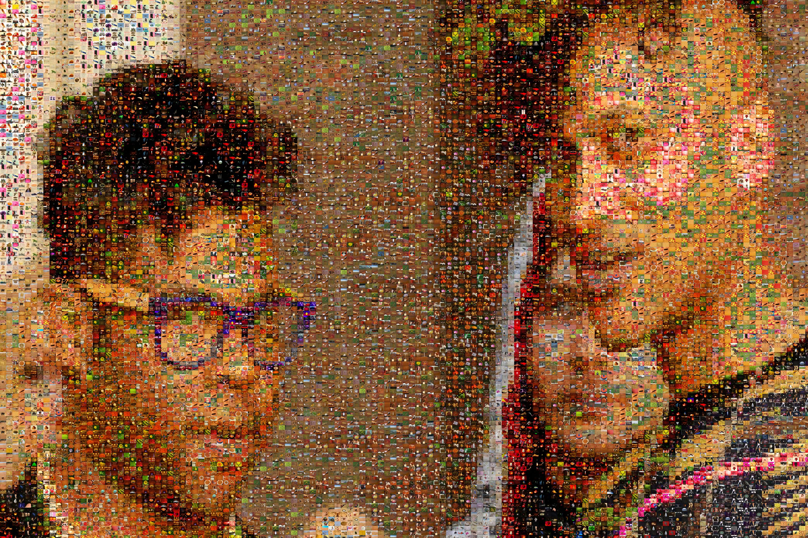
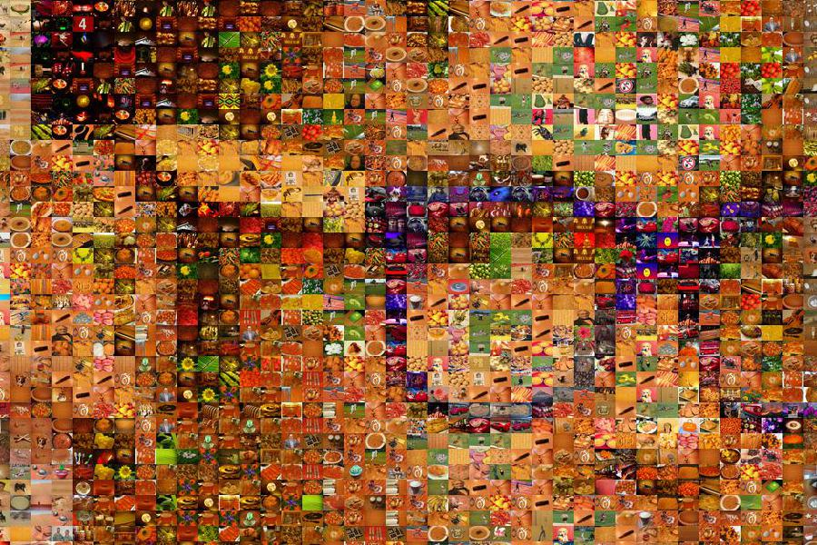
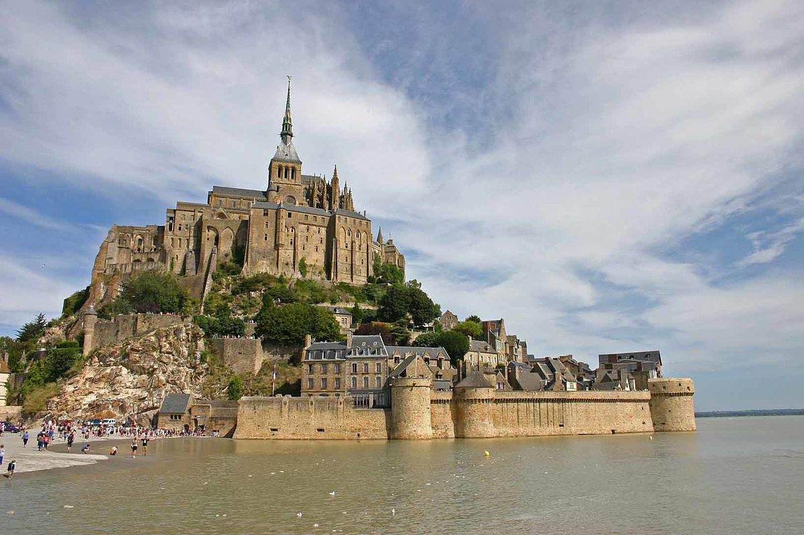
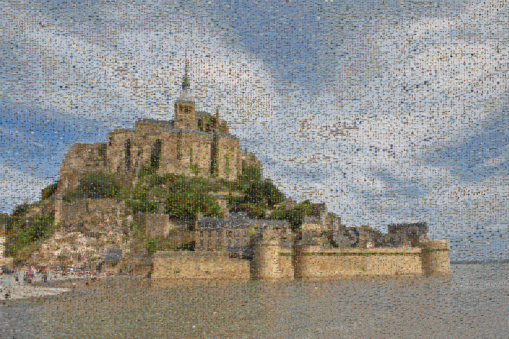
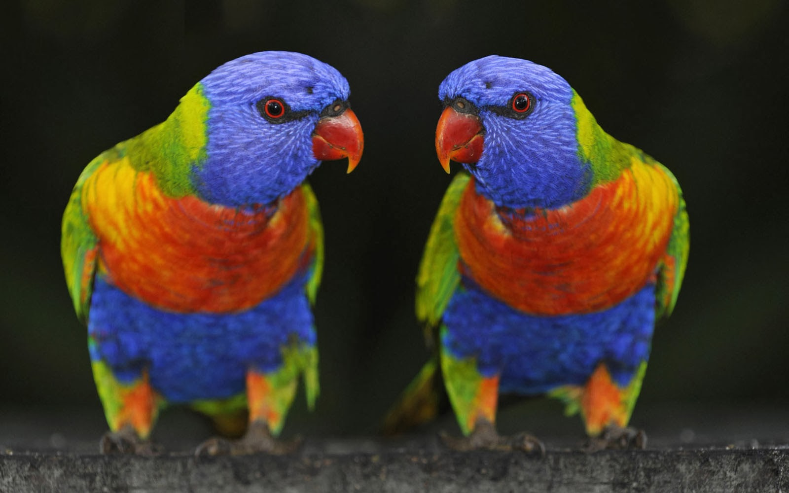

# Collager
I thought it would be cool to create an application that could recreate an image with a mosiac or collage of other images, referred to lovingly as "candidate images."
The original idea started out as a quick jupyter notebook over a weekend, but I ended up sinking a bunch of time into it and now it's kind of a full-blown thing.

**Note: I don't own any of the images presented in this README. Also, imagenet has some... interesting images in it. I don't take any responsibility for the weird stuff that might end up in these examples.**

## Examples


  

 

 

## Setup
I've included a conda environment that should cover the bases. Really you just need pandas, pillow, numpy (included with pandas), tqdm, and optionally jupyter.
```
conda env create -f environment.yml
```

### Dataset
I tested on my vacation photos, but I want a demoable dataset, so let's download some imagenet images to get us started. If you already have a dataset though, feel free to skip this step.

```
pip install awscli
aws s3 --no-sign-request sync s3://open-images-dataset/validation data/imagenet_validation
```

## Run

I broke the workflow out into three phases, all runnable as different commands from `main.py`.
1. `featurize` - This command will featurize whatever directory you specify for your candidate images. It's annoying to repeatedly featurize the same candidate images over and over as you're testing, so it will write out a pickled `DataFrame` that includes a line for each candidate image, a few nice-to-know details (like dimensions), as well as a column called `features`. For now, this is a 768 (256*3) long vector representing the histogram of the image. I normalize the histogram's color counts by the pixel count of the image to allow easy comparisons between images, regardless of their dimensions.
```
python main.py featurize data/imagenet_validation data/features.pickle --processes 4
```
(This ran in about 7 minutes on 16GB of RAM with 4 cores.)

2. `build` - I'm not a fan of this name, but this is essentially the math/business logic for determining which candidate images should go into which slot. For now I'm using root mean squared errors as the distance metric between the images' features, but a different metric would probably make more sense. There's a cli argument for specifying which to use, but `rms` is the only choice at this point. This should write a csv of a `DataFrame` that specifies which image goes to which row/column tile. It should also specify a `choice` value, which would've been better named `rank`. You could specify how many choices you'd like to keep for each tile. 9 is a good number because I implemented logic in the `tile` step that will ensure that a candidate image isn't adjacent to itself. 9 tiles would make it impossible for that to happen. In retrospect, now that I've written that tiling logic, I realize that it probably could've been done with 5 choices instead. YOLO. Build outputs a `tiles.csv` (or whatever name you choose) file that is a list of the top `n` (9 by default) choices for each slot of the image. `build` and `tile` are decoupled because I want to be able to run `tile` with different parameters without having to recompute the choices for each slot again. I shouldn't have to recompute all of that linear algebra just because I want my final product scaled up to fit on a billboard.
```
python main.py build examples/target0.jpg data/features.pickle data/tiles0.csv --tiles_per_row 100 --tile_aspect_ratio 1.5 --processes 4
```

3. `tile` - Now that `build` has decided which images should go where, let's actually create/populate/tile the new image. As of the time I'm writing this, the `tile` function checks to make sure that a candidate image isn't self-adjacent by checking its top left, top, top right, and left neighbors. This is sufficient because I'm building sequentially from the top left tile to the bottom right. If I were to parallelize in a way that didn't guarantee a particular traversal order, I couldn't do that. One parallelization option would be to have a thread for each row and have it always lag 1 tile behind the row above it. That would be fine, but doing that calculation is actually super fast and definitely not the slow part of this process. Reading the image file is the slow part. So that has been parallelized. I wanted the subprocesses to all open their image and immediately write it into a shared final image object, but I had trouble getting that to happen and it's not that big of a deal... So they all read, resize, and aspect ratio crop the candidate image and just return it to a list. Once all threads complete, those tiles are all pasted into the final image, which is surprisingly fast. Technically, that could eat up a lot of ram, but I haven't seen it become a problem, so when we start creating billboard-sized collages, revisit that part.  
```
python main.py tile data/tiles0.csv data/tiled0.jpg 5184 3456 --tile_aspect_ratio 1.5 --processes 4
```
